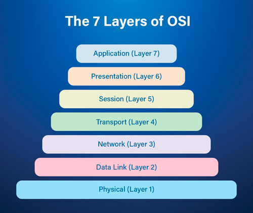

- 정리중

## 전송 제어 프로토콜 TCP(Transmission Control Protocol)
  - 서버와 클라이언트간에 데이터를 신뢰성있게 전달하기 위해 만들어진 프로토콜
  - 전송계층(Transport, Layer4) 에서 사용되는 프로토콜

### TCP의 특징
  - 포트 번호를 사용하여 프로세스 간 통신을 제공 
  - 스트림 지향 프로토콜
  - TCP는 데이터의 송수신 프로세스에서 바이트의 흐름으로 데이터를 주고받음
  - 기본적으로 IP계층 및 하위 계층에서의 패킷 손실, 중복, 오류에 의해 발생할 수 있는 모든 데이터 전송 문제를 검출하고 복구함
  - ex) 전화
 
    
## 사용자 데이터 프로토콜 UDP(User Datagram Protocol)
  - TCP와는 반대로 서버와 클라이언트가 비연결, 신뢰성이 없는 전송 프로토콜
  - 전송계층(Transport, Layer4) 에서 사용되는 프로토콜

### UDP의 특징
  - TCP와 동일하게 포트 번호를 사용하여 프로세스 간 통신을 제공
  - UDP는 비연결 서비스(connectionless service)를 제공한다.
  - UDP에 의해 보내지는 각 사용자 데이터그램은 독립된 데이터그램이라는 것을 의미함
  - TCP와는 달리 연결 설정이나 연결 종료가 없다.
  - UDP는 매우 산순한 프로토콜로 흐름 제어(flow control)가 따로 없다.
  - UDP에는 오류 제어(error control) 메커니즘이 존재하지 않는다. 
  - 즉, 송신자는 메시지가 손실이 되었는지 또는 중복이 되었는지를 알 수 없음을 의미한다.
  - ex) 카카오톡
    
 

## References
  - https://www.real-sec.com/2020/05/osi-7-layers-explained-the-easy-way/
